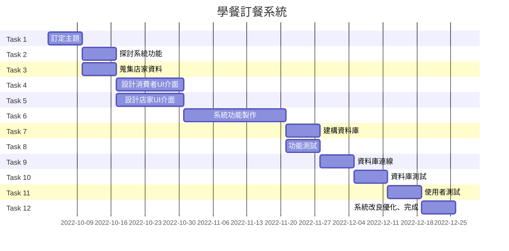
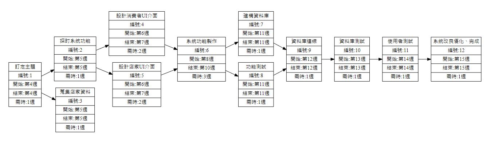

### 專題主題 : 學餐訂餐系統

|職位|姓名|學號|任務|
|:--:|:--:|:--:|:--:|
|組長|李宜蓁|C109118138|後端|
|組員|許雅妮|C109118141|測試&維護|
|組員|林芳妤|C109118144|資料庫|
|組員|蘇翔玉|C109118103|前端&UI|
|組員|鄭祺萱|C109118153|文書|
---
### 內容
每到中午時分，學生們一窩蜂的擠進學餐進食，可能晚了一步就要等相當長的時間才能用餐。於是我們想若是能夠製作一個訂餐系統、提前點餐，店家提前製作完成，不僅可以加速取餐時間，也能取代店家人工叫號的方式，避免離開一下回去時不知道自己是否可以取餐。

---
### 甘特圖

---
### PERT/CPM圖

### 關鍵路徑
1->2->5->6->8->9->10->11->12
