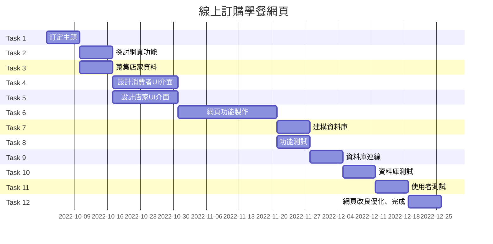

### 專題主題 : 線上訂購學餐網頁

|職位|姓名|學號|任務|
|:--:|:--:|:--:|:--:|
|組長|李宜蓁|C109118138|網頁後端|
|組員|許雅妮|C109118141|測試&維護|
|組員|林芳妤|C109118144|資料庫|
|組員|蘇翔玉|C109118103|網頁前端|
|組員|鄭祺萱|C109118153|文書|
---
### 內容
每到中午時分，學生們一窩蜂的擠進學餐進食，可能晚了一步就要等相當長的時間才能用餐。於是我們想若是能夠製作一個訂餐網頁、提前點餐，店家提前製作完成，不僅可以加速取餐時間，也能取代店家人工叫號的方式，避免離開一下回去時不知道自己是否可以取餐。

---
### 甘特圖

---
### PERT/CPM圖

---
### 功能性需求
1. 點餐&下單
2. 瀏覽店家
3. 註冊&驗證頁面

### 非功能性需求
1. 同時間可容納100人瀏覽及點餐(效能)
2. 點擊下單後3秒可以成功送出訂單(反應時間)
3. 網頁簡單易操作(使用性)

