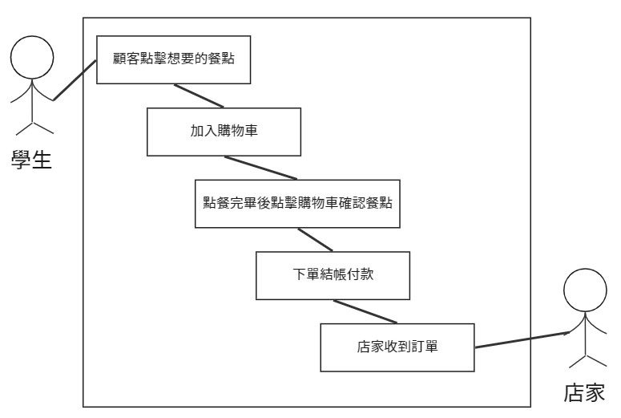
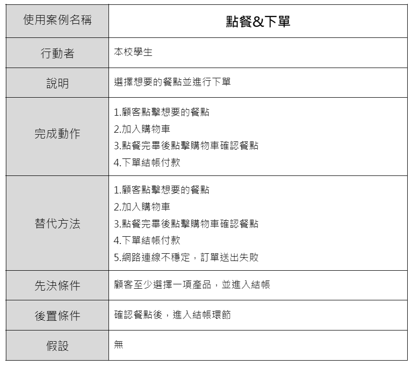
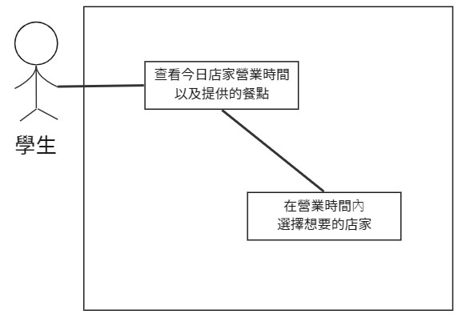
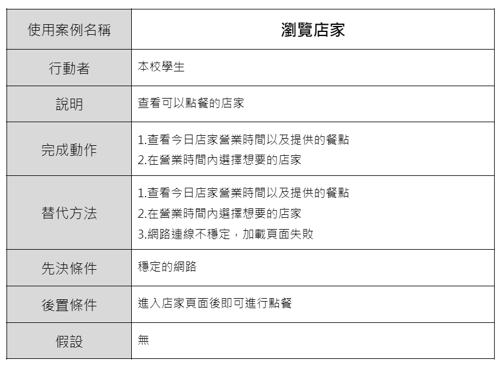
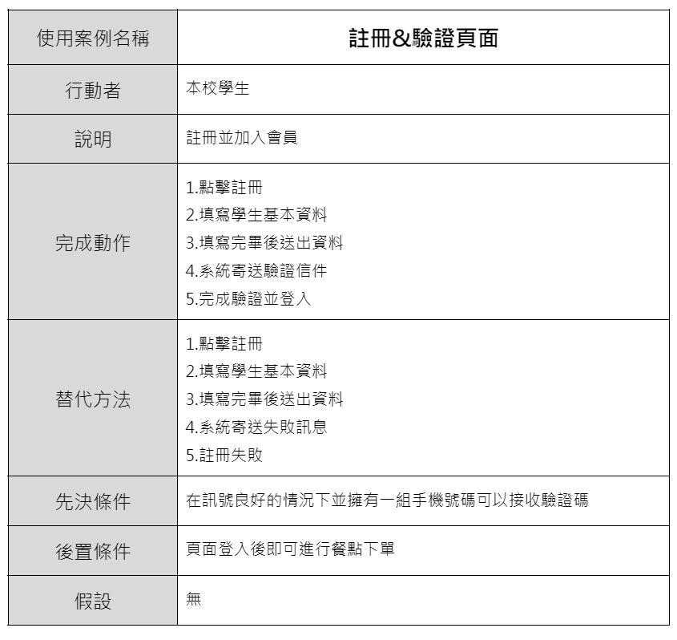

### 功能性需求
1. 點餐&下單
2. 瀏覽店家
3. 註冊&驗證頁面

### 非功能性需求
1. 同時間可容納100人瀏覽及點餐(效能)
2. 點擊下單後3秒可以成功送出訂單(反應時間)
3. 網頁簡單易操作(使用性)
---
### 功能分解圖(FDD)

---
### 需求分析

一個線上訂購學餐系統的需求分析簡述如下：
1. 學生可以藉由註冊會員來開始使用線上訂購學餐系統。
2. 學生可以瀏覽店家選擇想吃的餐點。
3. 學生下單前可以確認餐點是否正確。
4. 學生可以選擇想要的付款方式。
5. 學生可以確認餐點進度。
---
### 使用案例

##### 使用案例1圖-點餐&下單

##### 使用案例1說明

##### 使用案例2圖-瀏覽店家

##### 使用案例2說明

##### 使用案例3圖-註冊&驗證頁面

##### 使用案例3說明

